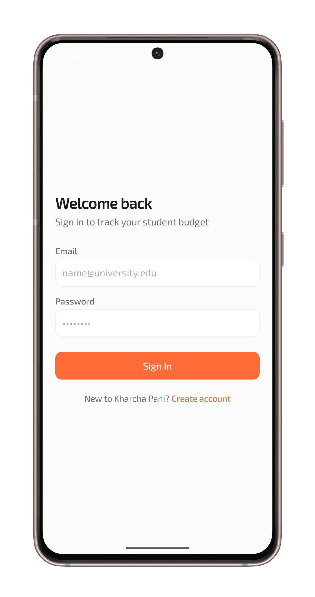
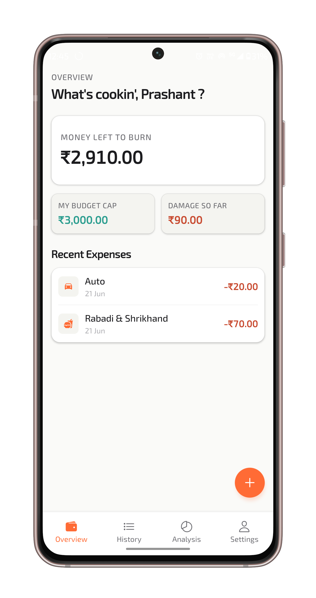
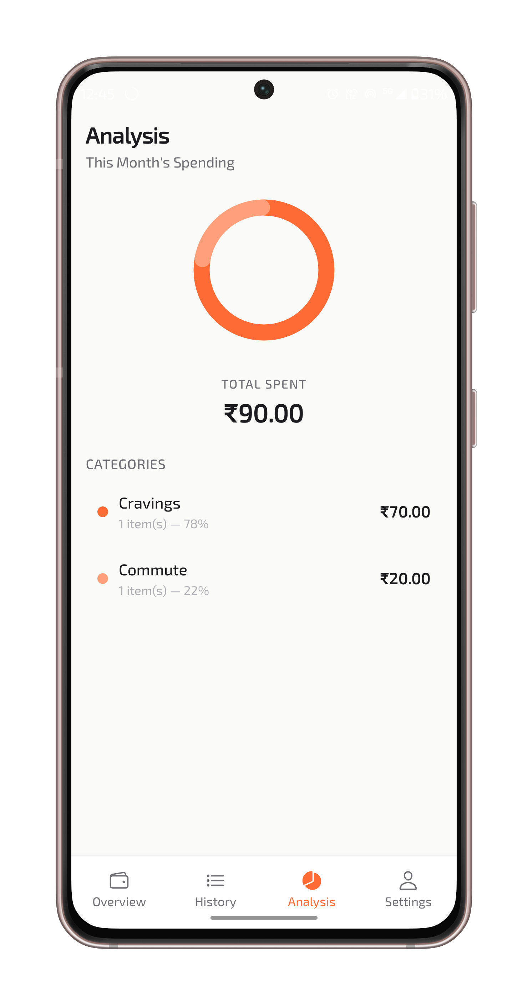
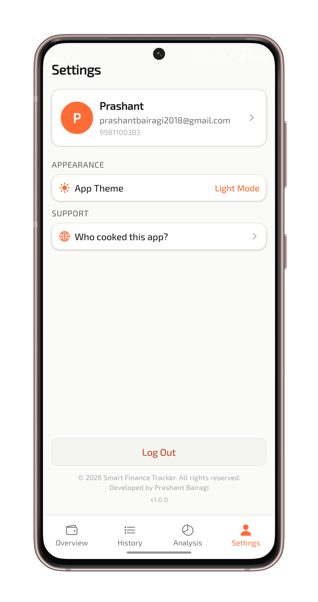

# 💸 Smart Finance Tracker

> A production-style personal finance backend built with **Java, Spring Boot, Spring Security, JWT Authentication, MySQL, Docker, and REST APIs**, powering the Android application **Kharcha Pani**.

---
## Screenshots

<p align="center">
  
   
   
  
  
</p>

## 📖 Overview

Smart Finance Tracker is a multi-user personal finance platform that allows users to securely manage expenses, track monthly budgets, analyze spending habits, and access their data through a mobile application.

The project was built to gain hands-on experience with real-world backend architecture including authentication, authorization, API design, database relationships, validation, Docker deployment, and secure user data isolation.

---

## ✨ Features

### 🔐 Authentication & Security

* User Registration
* User Login
* BCrypt Password Encryption
* JWT Authentication
* Stateless Session Management
* Protected API Endpoints
* User-Specific Data Access
* Profile Completion Flow

---

### 👤 User Management

* Profile Creation
* Profile Completion Workflow
* Budget Configuration
* Profile Retrieval
* Profile Updates

---

### 💰 Expense Management

* Create Expenses
* View Expenses
* Update Expenses
* Delete Expenses
* Category-Based Tracking
* Date-Based Tracking
* Multi-User Support
* Expense Ownership Validation

---

### 🛡 Security Features

* UUID-Based User Identification
* Spring Security Integration
* JWT Filter Authentication
* Unauthorized Access Protection
* User Isolation (users can access only their own expenses)

---

### ⚙ Backend Engineering

* DTO-Based Request Handling
* Global Exception Handling
* Input Validation
* Layered Architecture
* RESTful API Design
* Dockerized Deployment
* MySQL Persistence
* JPA/Hibernate ORM

---

## 🏗 Architecture

```text
Kharcha Pani (Android App)
              │
              ▼
      REST API Layer
              │
              ▼
     Spring Boot Backend
              │
              ▼
      Spring Security
              │
              ▼
       JWT Authentication
              │
              ▼
       Service Layer
              │
              ▼
      JPA / Hibernate
              │
              ▼
            MySQL
```

---

## 🧩 Domain Model

### User

```text
User
├── id (UUID)
├── email
├── password
├── firstName
├── lastName
├── phone
├── budget
└── profileComplete
```

### Expense

```text
Expense
├── id
├── amount
├── description
├── category
├── expenseDate
├── createdAt
├── updatedAt
└── user
```

### Relationship

```text
One User
     │
     ▼
Many Expenses
```

---

## 🔑 Authentication Flow

```text
Register
   │
   ▼
Password Encrypted (BCrypt)
   │
   ▼
User Stored
   │
   ▼
Login
   │
   ▼
JWT Generated
   │
   ▼
Client Stores Token
   │
   ▼
Authenticated Requests
   │
   ▼
JWT Filter Validation
```

---

## 🛠 Tech Stack

### Backend

* Java 21
* Spring Boot
* Spring Security
* Spring Data JPA
* Hibernate
* Maven

### Database

* MySQL

### Security

* JWT (JSON Web Token)
* BCrypt Password Hashing

### Deployment

* Docker
* Railway

### Tools

* IntelliJ IDEA
* Postman
* Git
* GitHub

---

## 📡 REST API Endpoints

### Authentication

```http
POST /api/v1/auth/register
POST /api/v1/auth/login
```

### User

```http
POST /api/v1/users/complete-profile
GET  /api/v1/users/profile
```

### Expenses

```http
POST   /api/v1/expenses
GET    /api/v1/expenses
GET    /api/v1/expenses/{id}
PUT    /api/v1/expenses/{id}
DELETE /api/v1/expenses/{id}
```

---

## 🐳 Docker

### Build

```bash
docker build -t smart-finance-tracker .
```

### Run

```bash
docker run -p 8080:8080 smart-finance-tracker
```

---

## 📱 Mobile Application

This backend powers the Android application:

# Kharcha Pani

Features:

* Expense Tracking
* Budget Tracking
* Spending Analytics
* Category Breakdown
* Profile Management
* Dark / Light Mode
* JWT Authentication
* Secure Session Management

APK releases are available through GitHub Releases.

---

## 🚀 Future Roadmap

* Email Verification & OTP Authentication
* Budget Usage Insights
* Monthly Financial Reports
* Category Analytics APIs
* Borrow & Lend Tracking
* Shared Expenses with Friends
* Expense Groups & Settlements
* Pagination & Advanced Filtering
* Push Notifications
* Play Store Release

---

## 📈 What I Learned

* Spring Security Fundamentals
* JWT Authentication & Authorization
* REST API Design
* DTO Pattern
* Database Relationships
* Docker Containerization
* Multi-User Architecture
* Validation & Exception Handling
* Real-World Backend Development

---

## 👨‍💻 About Me

Hi, I'm **Prashant Bairagi**.

I'm an Electronics & Telecommunication Engineering student passionate about backend development, software engineering, and building products that solve real-world problems.

Currently focused on:

* Java
* Spring Boot
* System Design Fundamentals
* Databases
* Backend Engineering

### Connect With Me

* LinkedIn: https://www.linkedin.com/in/prashant-bairagi-kmlpr
* Portfolio: https://prashant-bairagi-portfolio.vercel.app
* GitHub: https://github.com/PrashantOmBairagi
---
⭐ If you found this project interesting, consider giving it a star.
<p align="center">

  
